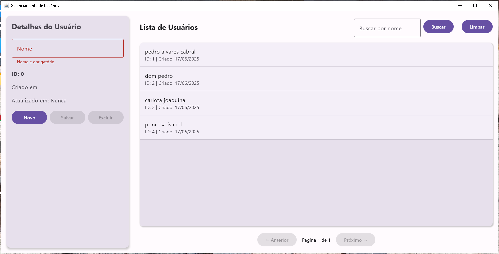

# Kotlin Desktop CRUD Application

Um moderno aplicativo desktop em Kotlin que demonstra operações CRUD de usuários usando Jetpack Compose for Desktop e se conecta a um backend REST.

## Tecnologias Utilizadas

- **Kotlin** - Linguagem de programação
- **Jetpack Compose for Desktop** - Framework UI moderno e declarativo
- **Retrofit** - Cliente HTTP para comunicação com o backend
- **Jackson** - Processamento de JSON
- **Gradle** - Sistema de build

## Requisitos

- JDK 17 ou superior
- Gradle 7.4+ (incluído via wrapper)
- Conexão com a internet para download das dependências
- O backend REST rodando na porta 8080

## Como executar

1. Certifique-se de que o backend esteja rodando
2. Execute o aplicativo com o seguinte comando:


```bash
# No Windows
.\gradlew.bat build


./gradlew build
```bash
# No Windows
.\gradlew.bat run


## Clonando o Repositório

```bash
# Clone o repositório
git clone https://github.com/seu-usuario/kotlin-desktop.git

# Entre no diretório do projeto
cd kotlin-desktop
```

## Funcionalidades

- Listagem de usuários com paginação (5 registros por página)
- Criação de novos usuários
- Atualização de usuários existentes
- Exclusão de usuários
- Validação de formulários
- Interface moderna e responsiva

## Estrutura do Projeto

```
kotlin-desktop/
├── build.gradle.kts      # Configuração do Gradle e dependências
├── src/
│   └── main/
│       ├── kotlin/
│       │   └── com/
│       │       └── example/
│       │           ├── Main.kt           # Ponto de entrada e UI principal
│       │           ├── User.kt           # Modelo de dados
│       │           ├── UserDto.kt        # DTOs para comunicação com a API
│       │           ├── UserApi.kt        # Interface da API REST
│       │           └── ApiService.kt     # Configuração do Retrofit
│       └── resources/                    # Recursos da aplicação
└── gradle/                               # Arquivos do wrapper Gradle
```

## Comunicação com o Backend

O aplicativo se comunica com um backend REST que deve estar rodando na URL `http://localhost:8080/api/`. 
A API espera e retorna objetos JSON com as seguintes operações:

- `GET /api/v1/users` - Obtém todos os usuários
- `GET /api/v1/users/{id}` - Obtém um usuário específico
- `POST /api/v1/users` - Cria um novo usuário
- `PUT /api/v1/users/{id}` - Atualiza um usuário existente
- `DELETE /api/v1/users/{id}` - Remove um usuário

## Personalização

Para alterar a URL do backend, edite a constante `baseUrl` no arquivo `ApiService.kt`.

## Contribuição

Contribuições são bem-vindas! Sinta-se à vontade para abrir issues ou enviar pull requests.

## Licença

Este projeto está licenciado sob a licença MIT - veja o arquivo LICENSE para detalhes.

## Tela



